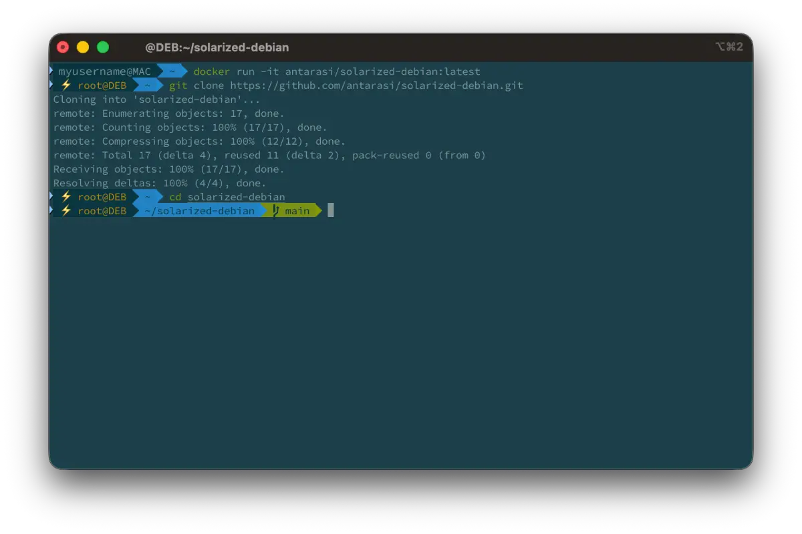

# solarized-debian

Debian with Solarized & Node — a ready-to-use developer container with a polished terminal environment.




## What's required
- [iTerm](https://iterm2.com) - or `brew install --cask iterm2` on Mac, Set Solarized Dark theme
- [Source Code Pro for Powerline font](https://github.com/powerline/fonts/blob/master/SourceCodePro/Source%20Code%20Pro%20for%20Powerline.otf) - Set this font in iTerm2 (iTerm → Preferences → Profiles → Text → Font) 

## What's included
**Base:** `debian:latest`

### Shell
- **Zsh** — set as the default shell for root
- **Oh My Zsh** — with the `agnoster` theme
- **zsh-autosuggestions** — fish-like command suggestions
- **zsh-syntax-highlighting** — real-time syntax coloring

### Color scheme
- **Solarized Dark dircolors** (`dircolors-solarized`) — consistent ls colors using the ansi-dark palette
- **Powerline fonts** — required for the agnoster prompt glyphs
- `TERM=xterm-256color` and full UTF-8 locale (`en_US.UTF-8`)

### Node.js
- **NVM** v0.40.2 — Node Version Manager
- **Node.js 22** — installed via NVM and set as default
- `node`, `npm`, and `npx` symlinked to `/usr/local/bin` for non-interactive shells

### Utilities
- `git`, `curl`, `wget`, `ca-certificates`, `nano`

## Usage

```bash
docker pull antarasi/solarized-debian:latest
docker run -it antarasi/solarized-debian
```

The container starts an interactive Zsh session.

## CI/CD

Images are automatically built and pushed to Docker Hub on every push to `main`.
